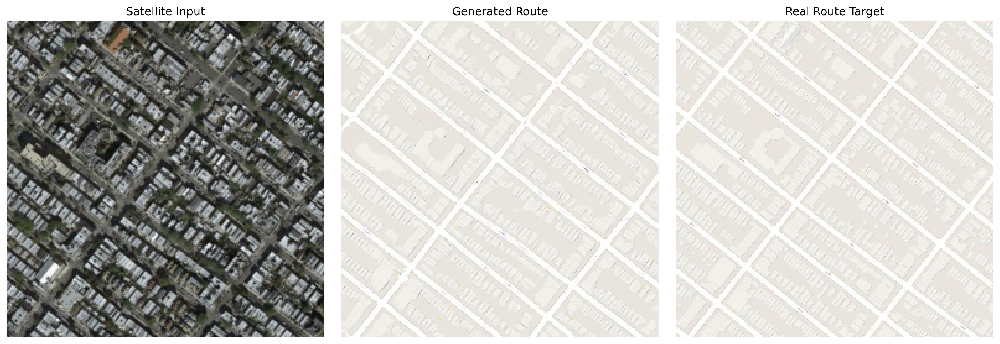
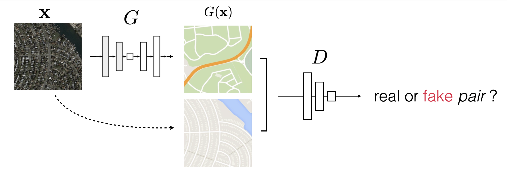

# Sat2Route
Transforming satellite imagery into navigable route maps using a pix2pix-inspired GAN model.

## Overview
Sat2Route is an image-to-image translation model trained on satellite-to-route datasets. It learns to generate realistic route maps from satellite images.

A satellite image (input) goes through the generator to create a route map. The discriminator then checks pairs: input with real route vs. input with generated route, deciding if they're real or fake.

## Model Architecture
- #### Generator:
	- Built on a [U-Net](https://arxiv.org/abs/1505.04597) architecture.
	- Uses [InstanceNorm2d](https://pytorch.org/docs/stable/generated/torch.nn.InstanceNorm2d.html) for normalization to stabilize training and boost feature extraction.
	- Applies channel capping to manage deeper layers efficiently.
- ### Discriminator
	- A [PatchGAN-style](https://arxiv.org/abs/1803.07422) discriminator.
	- Applies [spectral normalization](https://arxiv.org/pdf/1802.05957) to its convolutional layers for better stability.

The model combines these in an adversarial framework, where the generator aims to fool the discriminator while producing outputs conditioned on the input for accurate mapping.

## Loss Functions
Training relies on a weighted blend of losses to guide the model:

- **Adversarial Loss**: Pushes the generator to create route maps so convincing that the discriminator can't tell them apart from real ones.
- **Reconstruction Loss**: Keeps the output structurally aligned with ground-truth routes, using pixel-wise comparisons to maintain fidelity in shapes and connections.

This duo ensures outputs are realistic and accurate to the source material.

## Implementation Highlights
- Comprehensive unit tests for core components, including models, losses, datasets, and trainer, to catch issues early.
- Built in PyTorch, with custom tweaks like channel capping for enhanced performance and stability.

## Training Insights
For a hands-on look at the process, check out the [Kaggle Training Notebook](https://www.kaggle.com/code/mohamedmohiey/sat-to-route), which walks through data loading, model setup, and optimization steps.

## Requirements
- Python 3.11
- PyTorch & torchvision

## References
This project draws from key advancements in GANs and image translation:
- [pix2pix](https://arxiv.org/pdf/1611.07004) as the core inspiration.
- [U-Net](https://arxiv.org/abs/1505.04597) for the generator backbone.
- [cGAN](https://arxiv.org/pdf/1411.1784) for conditional generation principles.
- [PatchGAN](https://arxiv.org/abs/1803.07422) for patch-based discrimination.
- [Spectral Norm](https://arxiv.org/pdf/1802.05957) for discriminator stabilization.